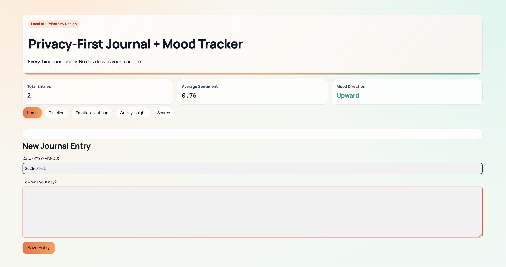
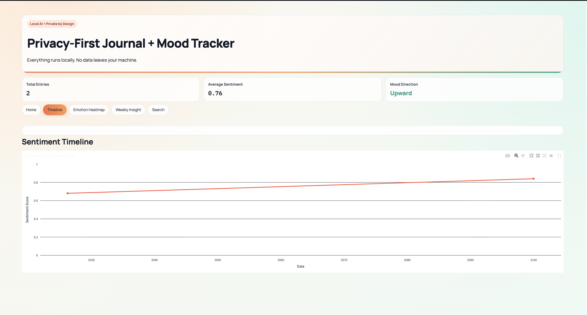
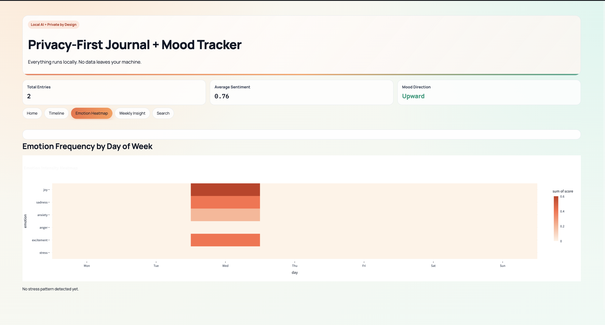
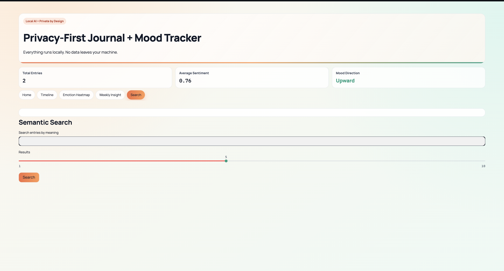

# Journal + Mood Tracker

A privacy-first journaling app that runs entirely on your machine. No accounts, no cloud sync, no telemetry.

Two interfaces — pick whichever suits you:

- **`journal-mood-tracker.html`** — single-file web app, open in any browser, zero setup
- **Streamlit + FastAPI stack** — full backend with local AI analysis (sentiment, semantic search, weekly reflections via Ollama)

---

## Screenshots

### Dashboard — New Entry


### Sentiment Timeline


### Emotion Frequency by Day of Week


### Semantic Search


---

## Quick Start (HTML)

No install. Download `journal-mood-tracker.html` and open it in a browser.

Features: 6-tab layout (Home, Timeline, Calendar, Heatmap, Weekly Insight, Search), mood tracking, productivity scoring, confetti on save, dark/light mode. All data stays in memory — nothing written to disk.

---

## Full Stack Setup

### Requirements
- Python 3.9+
- [Ollama](https://ollama.com) installed and running

### Install

```bash
python3 -m venv .venv
source .venv/bin/activate       # Windows: .venv\Scripts\activate
pip install -r requirements.txt
ollama pull llama3
```

On low-memory machines:
```bash
ollama pull qwen2.5:3b
export OLLAMA_MODEL=qwen2.5:3b
```

### Environment

```bash
cp .env.example .env
```

See `.env.example` for all options.

### Run

In two separate terminals:

```bash
# Terminal 1 — API
python -m app.main

# Terminal 2 — Dashboard
streamlit run dashboard.py
```

- API: `http://localhost:8000`
- Dashboard: `http://localhost:8501`

---

## Docker

```bash
cp .env.example .env
docker compose up --build
```

`journal.db` mounts as a volume so entries survive restarts.

---

## Safe Mode

Verifies Ollama is reachable, the configured model is pulled, and the DB path is writable before accepting requests:

```bash
python -m app.main --safe-mode
# or
SAFE_MODE=1 python -m app.main
```

---

## Demo Data

Populate 30 days of synthetic entries:

```bash
python -m app.main --demo
```

---

## Optional Auth (Remote Access)

Local requests work without auth by default. For non-localhost access:

```bash
export LOCAL_API_TOKEN="your-token"
python -m app.main
```

Clients pass `Authorization: Bearer your-token` or `X-API-Token: your-token`.

---

## API

| Method | Path | Description |
|--------|------|-------------|
| `POST` | `/entries` | Create entry, run analysis |
| `GET` | `/entries` | List all entries |
| `GET` | `/entries/{date}` | Fetch by `YYYY-MM-DD` |
| `GET` | `/insights/weekly` | 7-day local insight |
| `GET` | `/insights/monthly` | 30-day local insight |
| `GET` | `/search?q=...` | Semantic search |

---

## Project Structure

```
journal-mood-tracker/
├── app/
│   ├── main.py
│   ├── models.py
│   ├── database.py
│   ├── sentiment.py
│   ├── embeddings.py
│   └── insights.py
├── assets/screenshots/
├── tests/
├── dashboard.py
├── journal-mood-tracker.html
├── requirements.txt
└── docker-compose.yml
```

---

## Privacy

- Entries stored in `journal.db` (local SQLite, gitignored)
- Sentiment, emotion, embeddings, and insight generation run entirely locally
- No external API calls

---

## Tests

```bash
pytest -q
```

Coverage: sentiment/emotion pipelines, insight generation, API integration (`/entries`, `/search`, `/insights/weekly`, `/insights/monthly`).

---

## CI

`.github/workflows/ci.yml` runs lint (`ruff`), tests (`pytest`), and dependency audit (`pip-audit`) on every push.

---

## Contributing

See `CONTRIBUTING.md`. PRs should be focused, include test evidence, and respect the privacy-first constraint — no change should add external data transmission.
